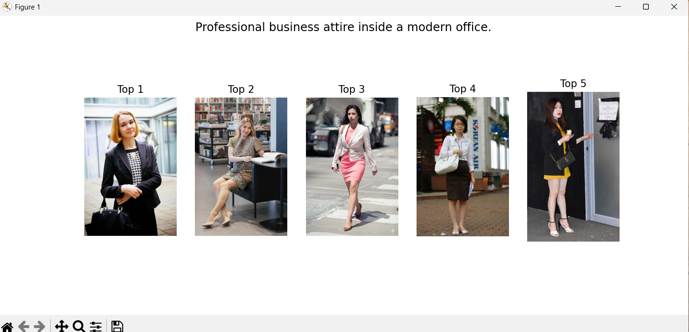

# 🧠 Multimodal Fashion & Context Retrieval

## 📌 Overview

This project implements a **multimodal fashion image retrieval system** that retrieves relevant fashion images based on **natural language queries**.
The system understands **clothing attributes, visual appearance, and contextual intent** (e.g., formal vs casual), enabling more accurate retrieval than keyword-based search.

---

## 📸 Retrieval Results

### 1.Attribute-specific Query
**1.Query:** A person in a bright yellow raincoat  


---

### 2.Contextual Query
**Query:** Professional business attire inside a modern office  


---

### 3.Complex Semantic:
**Query:** Someone wearing a blue shirt sitting on a park bench.


---
### 4.Style Inference
**Query:** Casual weekend outfit for a city walk  


---

### 5.Compositional Query
**Query:** A red tie and a white shirt in a formal setting  


## 🧩 Problem Statement

The goal is to build an intelligent search engine that:

* **Input:** A natural language fashion query (e.g., *“A red tie and a white shirt in a formal setting”*)
* **Output:** A ranked list of fashion images that best match the query


---
## 💡 Key Ideas & Approach

### Baseline

* Used **CLIP (Contrastive Language–Image Pretraining)** for zero-shot image–text alignment

### Improvements Beyond Vanilla CLIP

* **Attribute-aware indexing**

  * Color distribution extracted from images (HSV histograms)
  * Fashion attributes loaded from Fashionpedia annotations
* **Soft context-aware re-ranking**

  * Lightweight intent extraction from query (e.g., “formal”, “casual”)
  * Used only for *soft boosting*, not hard filtering


---

## 🏗️ Architecture / System Overview

```
Text Query
   │
   ▼
CLIP Text Encoder
   │
   ▼
FAISS Vector Search  ──► Top-N Candidate Images
   │
   ▼
Soft Re-ranking (Context + Color)
   │
   ▼
Final Ranked Images
```


## 📊 Dataset

* **Dataset Used**: Fashionpedia (Validation/Test images)
* **Why Fashionpedia**:

  * Rich fashion diversity
  * Fine-grained attribute annotations
  * Suitable for fashion-centric reasoning
* **Usage**:

  * Images are used **only for indexing**, not supervised training
  * Annotations are used as **weak signals** for attribute awareness
* **Limitations**:

  * Context labels (e.g., *office*, *park*) are not explicit
  * Bias toward runway / editorial images

---

## 🗂️ Project Structure

```
fashion-context-search/
│
├── indexer/
│   ├── clip_encoder.py        # CLIP image embeddings
│   ├── color_extractor.py     # Color histogram features
│   ├── attribute_encoder.py  # Fashionpedia attribute loader
│   └── build_index.py         # FAISS index builder
│
├── retriever/
│   ├── query_parser.py        # Lightweight intent extraction
│   ├── search.py              # Retrieval + re-ranking logic
│   └── show_results.py        # Visualization script
│
├── data/
│   ├── images/                # Fashion images (not pushed)
│   └── annotations.json
│
├── screenshots/               # Retrieval results
├── requirements.txt
└── README.md
```

---

## ⚙️ Installation & Setup

```bash
# Create virtual environment
python -m venv venv
source venv/Scripts/activate  # Windows

# Install dependencies
pip install -r requirements.txt
```

---

## ▶️ How to Run

### 1️⃣ Build Image Index

```bash
cd indexer
python build_index.py
```

### 2️⃣ Run Retrieval & Visualization

```bash
cd retriever
python show_results.py
```

---

## 🧪 Evaluation Queries

The system is evaluated using the following prompts:

* **Attribute Specific**:
  *“A person in a bright yellow raincoat.”*

* **Contextual / Place**:
  *“Professional business attire inside a modern office.”*

* **Complex Semantic**:
  *“Someone wearing a blue shirt sitting on a park bench.”*

* **Style Inference**:
  *“Casual weekend outfit for a city walk.”*

* **Compositional**:
  *“A red tie and a white shirt in a formal setting.”*

---

## ⚖️ Design Choices & Tradeoffs

### Why CLIP?

* Strong zero-shot vision–language alignment
* No training required
* Generalizes well to unseen queries

### Why FAISS?

* Scales efficiently to millions of vectors
* Industry-standard vector retrieval

### Why Soft Re-ranking?

* Avoids brittle hard rules
* Improves precision without sacrificing recall

### What Was Not Done

* No supervised fine-tuning (to preserve zero-shot nature)
* No heavy scene classifiers (kept solution lightweight)

---
## 📈 Scalability

* Image embeddings are computed **once**
* FAISS supports **million-scale datasets**
* Retrieval time grows sub-linearly

This system can scale to **1M+ images** with minimal changes.

---

## 🚀 Zero-Shot Capability

**Zero-shot** means the system can handle queries it has **never seen before**.

* CLIP enables unseen color, style, and clothing combinations
* No hard-coded labels or rules
* Limitations arise when context is visually ambiguous

---

## ⚠️ Limitations

* Context (e.g., *park*, *office*) inferred indirectly
* Fashionpedia images are biased toward editorial scenes
* Some compositional queries remain visually ambiguous

---

## 🔮 Future Work

* Learnable re-ranking using contrastive loss
* Scene classifiers for explicit context detection
* Weather & location-aware embeddings
* Better compositional reasoning for multi-garment queries


---

## 👤 Author

**Antara Arkasali**
AI / ML Enthusiast
GitHub: [https://github.com/antara483](https://github.com/antara483)

---


